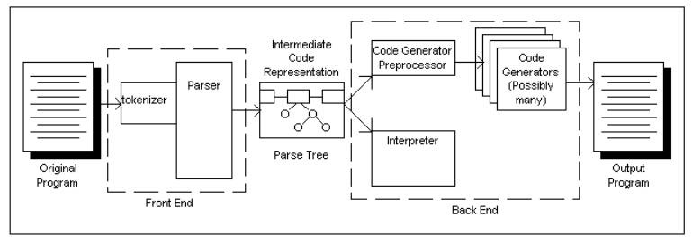
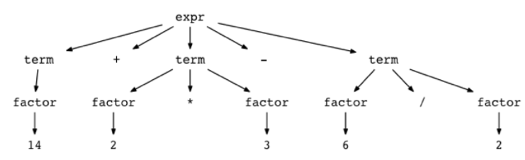
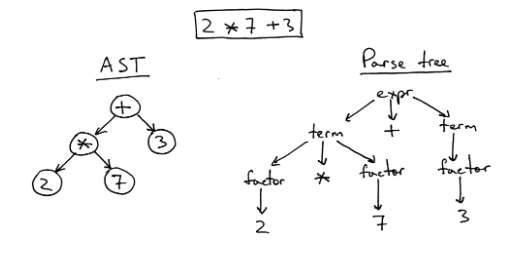
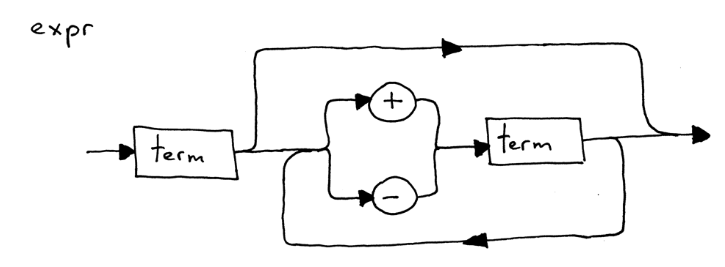
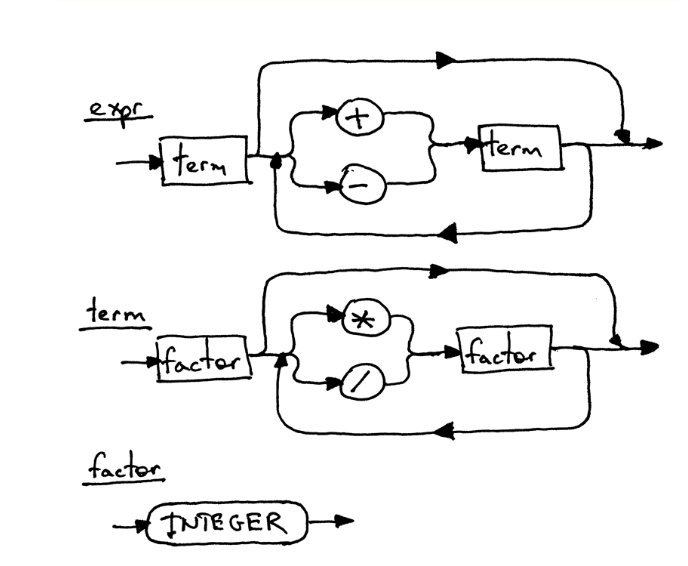

bullpark
=============
# 목차
* 개념다지기
    * Lexical analysis
    * Token & Lexical token and lexical tokenization
    * Parser & Parser Tree
    * AST
    * Node
* 기획해보기
    * 어떤 언어로?
    * 목표는?
* 개발해보자
    * 참고한 글
    * a+b 구현
    * a+b+c+.... 구현
    * a+b*c 구현
    * (a+b)*c 구현
    * parser tree < AST
    * 변수 선언 구현

# 개념다지기
## Lexical analysis(어휘분석) 
컴퓨터 과학에서 프로그래밍 언어를 처리하는 처리하는 최초의 단계
한국말로 해석하면 어휘 분석이라는 뜻이며 토큰 단위로 나누는 역할을 한다해서 “tokenizer”라고 부르기도 한다.


위 그림에서 알 수 있듯이 최초 단계에서 역할을 수행함

## Token
Token은 파싱 목적을 위해 분류화를 명시적으로 지시하는 어휘소를 표현하는 구조의 하나이다.


python 예문1: int num = 1

#### Lexical token   
    keyword | int   
    identifier | num   
    operator | =   
    (literal | value) | 1   

#### Lexical tokenization
    [(keyword, int), (identifier, num), (operator, =), (literal, 1)]
## Parser
입력 구문의 각 토큰을 번역 결과물로 만들기 위한 과정으로 Parser에서 수행한다. 파서는 다양한 형태로 표현할 수 있는데 정규화를 할 수 있을 때 Parser Tree로 구현하면 효과적이다.

### Parser Tree
*14 + 2 * 3 - 6 / 2* 연산을 트리로 구현하면 아래와 같음


__나는 처음에 이 방식을 사용하여 트리를 구현헀지만 더 좋은 방법을 찾음__

## AST(Abstract Syntax Trees)
컴퓨터 과학에서 추상 구문 트리(abstract syntax tree, AST), 또는 간단히 구문 트리(syntax tree)는 프로그래밍 언어로 작성된 소스 코드의 추상 구문 구조의 트리이다. 이 트리의 각 __노드__ 는 소스 코드에서 발생되는 구조를 나타낸다.


위 사진에서 알 수 있듯 AST가 Parse Tree 보다 간결함
## Node
아래 그림의 동그란것들을 “Node”라고 부름  


# 기획해보기
## 어떤 언어로?
인터프리터 언어의 작동원리를 알고 그 원리를 직접구현해보고자 함.  

google에서 개발한 GO언어를 사용하여 만들어보자.
이유: 빠른 속도로 코드 해석을 빠르게 하기 위해서

go라는 언어를 기반으로 인터프리터 언어개발

## 목표는?
사칙연산 구현 , 숫자형 변수 선언 및 사용가능할 정도 까지

# 개발해보자
## 참고한 글
https://ruslanspivak.com/lsbasi-part1/   
## a+b 구현
a+b를 토큰화 하면 

    [(int, a), (plus, +), (int, b)]
이며
“a+b”라는 구문은 토큰의 위치가 정적이므로
첫번째 토큰은 int, 두번째 토큰은 plus, 세번째 토큰은 int임을 체크하기위한 “eat function”을 만듬 
```golang
func (par *parser) eat(tokenType string) {
    if par.currentToken.tokenType == tokenType {
        par.currentToken = par.lexer.get_next_token()
    } else {
        reportError("!!Token Type Error!!")
    }
}
```

## a+b+c+...구현
식의 형태가 고정되어 있지 않아 아래와 같은 구조를 통해 연산이 이루어 져야함.


```golang
func (par *parser) term():
    token := par.currentToken
    par.eat("INT")
    return token.tokenValue


func (par *parser) expr():
    par.currentToken = par.get_next_token()


    result = par.term()
    while self.currentToken.tokenType in (PLUS, MINUS):
        token = par.currentToken
        if token.tokenType == “PLUS” {
            par.eat(“PLUS”)
            result = result + par.term()
	} else if token.tokenType == “MINUS” {
            par.eat(“MINUS”)
            result = result - par.term()
	}
    return result
```
## a+b*c구현
a+b+c는 어떤 순서로 계산하여도 아무 문제 없기에 위 코드는 앞에서 부터 순차적으로 계산함
하지만 곱하기와 나누기는 덧셈과 뺄셈 우선 순위가 높아 위 코드에서 구조 수정이 필요함


따라서 위 그림과 같이 기존의 term 의 역할을 수정하고 factor함수를 만들어 준다.
 

(a+b)*c구현괄호 안에 있는 식은 항상 먼저 계산하기에 2 * (7 + 3)를 예를 들면

다음과 같이 복잡한 구조가 나온다.
기존의 factor함수의 역할 을 확장하여

```golang
func (par *parser) factor() *node {
	.
	.
	.
    else if storeToken.tokenType == "LEFTPAREN" {
        par.eat("LEFTPAREN")
        node := par.Expression()
        par.eat("RIGHTPAREN")
        return node
    }
```


와 같이 수정한다.

## parser tree < AST
__기존의 parser tree 방식에서 AST방식으로 코드를 갈아엎고 다시 짬__
```golang
func (par *parser) factor() *node {
    storeToken := par.currentToken
    if storeToken.tokenType == "PLUS" {
        par.eat("PLUS")
        return &node{binOp: nil, num: nil, unaryOp: &unaryOp{token: storeToken, expr: par.factor()}}
    } else if storeToken.tokenType == "MINUS" {
        par.eat("MINUS")
        return &node{binOp: nil, num: nil, unaryOp: &unaryOp{token: storeToken, expr: par.factor()}}
    } else if storeToken.tokenType == "INT" {
        par.eat("INT")
        return &node{binOp: nil, num: &num{token: storeToken}, unaryOp: nil}
    } else if storeToken.tokenType == "LEFTPAREN" {
        par.eat("LEFTPAREN")
        node := par.Expression()
        par.eat("RIGHTPAREN")
        return node
    } else {
        node := par.variable()
        return node
    }
}

func (par *parser) term() *node {
    _node := par.factor()
    var resultNode *node = _node
    for par.currentToken.tokenType == "MUL" || par.currentToken.tokenType == "DIV" {
        token := par.currentToken
        if token.tokenValue == "*" {
            par.eat("MUL")
        } else if token.tokenValue == "/" {
            par.eat("DIV")
        }
        resultNode = &node{binOp: &binOp{left: _node, op: token, right: par.factor()}, num: nil, unaryOp: nil}
    }
    return resultNode
}

func (par *parser) Expression() *node {
    _node := par.term()
    var resultNode *node = _node
    for par.currentToken.tokenType == "PLUS" || par.currentToken.tokenType == "MINUS" {
        token := par.currentToken
        if token.tokenValue == "+" {
            fmt.Println("++")
            par.eat("PLUS")
        } else if token.tokenValue == "-" {
            par.eat("MINUS")
        }
        resultNode = &node{binOp: &binOp{left: _node, op: token, right: par.term()}, num: nil, unaryOp: nil}
    }
    fmt.Println(resultNode.binOp.right)
    return resultNode
}

type node struct {
    binOp    *binOp
    num      *num
    unaryOp  *unaryOp
    compound *compound
    assign   *assign
    _var     *_var
}


type binOp struct {
    left  *node
    op    token
    right *node
}


type unaryOp struct {
    token token
    expr  *node
}
type num struct {
    token token
}
type compound struct {
    children []*node
}
type assign struct {
    left  *node
    op    token
    right *node
}
```


분석된 토큰을 바탕으로 Parser에게 node tree즉 Abstract Syntax Trees를 만드는 역할줌.
만들어진 AST의 node 각각에 방문하여 들어있는 node 값에 따라 서로 다른 처리를 하는 녀석들을 visitor라고함.


연산자를 담고있는 node는 그 하위의 노드끼리 연산을 하는 처리를 하며, 숫자가 담긴 node는 수 그대로를 반환하는 역할을 함.
```golang
func (inter *interpreter) visit(node *node) int {
    if node.binOp != nil {
        return inter.visit_BinOp(node)
    } else if node.num != nil {
        return inter.visit_Num(node)
    } else if node.unaryOp != nil {
        return inter.visit_UnaryOp(node)
    }
    return 0
}
```

visit_BinOp(node) 오른쪽과 왼쪽 값의 node가 num_node가 될때까지 visitor를 실행하여 사용된 연산자에 따라 연산하여 값을 반환함
visit_Num(node) num_node 속 값을 반환함
visit_UnaryOp(node) plus냐 minus이냐에 따라 뒤에 오는 node의 최종 연산값에 -1 또는 1을 곱하여 반환함

## 변수 선언 구현
변수 선언을 구별하기 위해 선언 방식을 var a = 1;로 제한함
이 형태 또한 제한에 의해 자리가 고정 되어 있음.

    [(key, var), (id, a), (op, =), (val, 1), (semi, ;)]
var는 시작을 알리며 ;은 끝 또는 다른 시작을 암시함을 알 수 있음.
```golang
func (par *parser) program() *node {
    result := par.compound_statement()
    par.eat("ERROR")
    return result
}


func (par *parser) compound_statement() *node {
    nodes := par.statement_list()


    root := &compound{children: []*node{}}
    for i := 0; i < len(nodes); i++ {
        root.children = append(root.children, nodes[i])
    }
    return &node{compound: root}
}


func (par *parser) statement_list() []*node {
    results := []*node{}
    results = append(results, par.statement())
    for par.currentToken.tokenType == "SEMI" {
        par.eat("SEMI")
        results = append(results, par.statement())
    }
    return results
}


func (par *parser) statement() *node {
    if par.currentToken.tokenType == "VARIABLE" {
        return par.assignment_statement()
    } else {
        return par.Expression()
    }
}


func (par *parser) assignment_statement() *node {
    par.eat("VARIABLE")
    left := par.variable()
    op := par.currentToken
    par.eat("ASSIGN")
    right := par.Expression()
    return &node{assign: &assign{left: left, op: op, right: right}}
}


func (par *parser) variable() *node {
    node := &node{_var: &_var{par.currentToken}}
    par.eat("ID")
    return node
}
```

    program() 시작과 끝   
    compound_statement() 복합문 생성   
    statement_list() 구문들을 리스트에 담아 리턴   
    statement() 구문의 종류에 따라 해당 구문 생성(선언문 뒤에 선언문 또는 연산문등  다양한 구문이 올 수 있기에 이 과정이 필요함)   
    assignment_statement() 선언문 node 생성   
    variable() 변수id node 생성   

node를 생성하는 코드를 만듬. 이제 만들어진 노드를 방문하여 처리하는 새로운 visitor를 만들어야함
```golang
 	.
    .
    .
	} else if node.compound != nil {
        return inter.visit_Compound(node.compound)
    } else if node.assign != nil {
        inter.visit_Assign(node)
    } else if node._var != nil {
        return inter.visit_Var(node)
    }
```
    visit_Compound(nodes) 복합문속 nodes를 재방문(re-visit)시킴   
    visit_Assign(node) 선언명(id)을 이름으로 값을 저장함
    visit_Var(node) 선언된 변수를 호출할 때 저장 값에 접근하여 해당 값을 반환함   

# 기억에 남는 부분 혹은 인상깊은 부분과 그 이유
불과 1년전 인터프리터 언어는 어떻게 만들어지는지 궁금했는데
코드의 한글자 한글자를 단위화 하여 분석되어 작동하며
이와 관련한 부분인 토큰과 어휘분석 파트가 가장 인상 깊었다.
# 탐구활동을 통해 새롭게 알게 된 점, 느낀점, 생각하게 된 점 등
이번 탐구를 통해 AST구조, 토큰등 언어 개발의 꼭 필요한 개념에 대하 새롭게 알게되었으며 단순히 “인터프리터 언어는 이렇게 만들어지는구나!!”가 아닌
인터프리터 언어의 작동원리를 조사해가는 과정 속에서 다양한 프로그래밍 언어들의 각기 다른 유형의 문법들을 접하게 되었으며 좋은 언어와 나쁜 언어란 무엇인가를 생각하게 되었으며 대표적인 예시로 나쁜 언어인 자바스크립트는 예측 불가능한 값을 반환하는 단점이 있으며 이를 보완하여 등장한 좋은 언어인 타입스크립트를 예로 들 수 있을것 같다. 파이썬이라는 언어도 언어의 자유도는 높지만 예측불가능성 또한 높다는 단점이 있다. (예시 Indentation 문제 등) 하지만 파이썬은 타입스크립트와 같은 보완 언어가 없다. 그리하여 파이썬에 관해 더 조사하고 파이썬 언어의 예측불가능성을 줄일 수 있는 언어를 기획해볼 것이다.
# 추가로 찾은 내용
보완언어는 결국 파이썬으로 컴파일 해주어야 하기에 컴파일 언어에 대한 이해가 
필요하다. 컴파일 과정은 크게 3가지로 나뉘며
* 분석
* 변환
* 코드 생성

3가지로 나뉘며, 1. 분석 단계에서는 어휘 분석을 통해 토큰을 나눈다. 어디서 많이 
들어보지 않았는가? 맞다 분석 단계는 인터프리터 언어의 과정과 별 다를게 없다. 
2. 변환을 통해 노드를 생성하고 AST를 구성한다. 3. 코드 생성에서는 최종 단계로 
AST를 가지고 문자열 같은 코드 형태로 출력하는 일을 하게된다.
# 결론 및 느낀점
세상에는 정말 다양한 컴퓨터 언어들이 존재하며 모두 각각의 장단점을 가지고 있으며 형태 또한 다르다. 하지만 이 모든 컴퓨터 언어에는 공통점이 있으며 그것은 바로 개발 원리와 과정이다. 어떤 순서로 작동하며 어떻게 작동하는지 등 말이다. 원리를 아는 것은 모든 언어를 이해하는 발판이 된다고 생각했으며 앞으로 더 자세하고 전문적인 내용을 대학 과정을 통해 배워보고 싶다.
이번 탐구를 하면서 나는 지금 까지 많은 언어들을 접해보지 못한 우물 안 개구리 라는 것을 똑똑히 느꼈고 많은 것을 모른다는 것에서 오는 두려움 보다 앞으로 더 배워나갈 기대감을 느꼈다.
